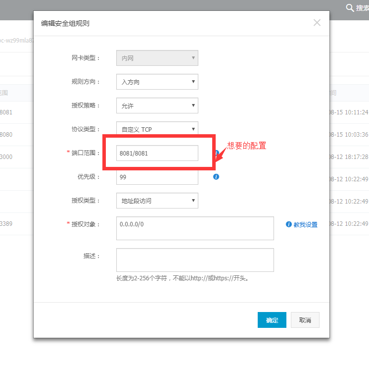
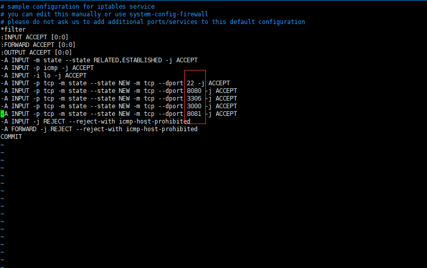

### 阿里云安全组配置

配置自己需要的端口，授权对象默认即可
上述步骤完成后，需要在主机上配置防火墙
[配置防火墙]: http://blog.sina.com.cn/s/blog_6e00431d0102vipz.html	"iptables配置"
`cat /etc/sysconfig/iptables`查看防火墙规则文件


编辑该文件，添加自己在安全组配置的端口`注意添加80端口，nginx默认监听80端口`
保存后`service iptables save`
重启防火墙`service iptables restart`
配置完成

### 安装nodejs
* wget https://nodejs.org/dist/v6.9.5/node-v6.9.5-linux-x64.tar.xz
* tar xvf node-v6.9.5-linux-x64.tar.xz
* 切换到 root 用户，全局配置nodejs
  ``` javascript
  vi /etc/profile
  在最下面加入
  # node （注释作用）
  export NODE_HOME=/usr/local/src/node
  export PATH=$PATH:$NODE_HOME/bin  
  export NODE_PATH=$NODE_HOME/lib/node_modules 
  :wq （保存并退出）
  source /etc/profile （使配置文件生效）
  ```

* 配置npm淘宝镜像
  ``` javascript
  npm config set registry https://registry.npm.taobao.org 
  npm info underscore	// 有输出即可
  ```

### 安装配置nginx

压缩包和yum两种安装方式，这里介绍yum安装
`yum install nginx`
`service nginx start`
`wget http://127.0.0.1 将会在当前路径下载一份index.html`

[nginx配置]: https://yq.aliyun.com/articles/47359

nginx的配置文件在`/etc/nginx/nginx.conf`，代理的静态文件目录`/usr/share/nginx/html/`

``` javascript
	# user  www www;
worker_processes  1;
error_log /var/log/nginx/error.log;
pid       /var/run/nginx.pid;

events {
	use epoll;
	worker_connections 1024; 
}

http {	
	include       mime.types;
	default_type  application/octet-stream;
	
    #access_log    /var/log/nginx/access.log;
	#log_format main  '$remote_addr - $remote_user [$time_local] "$request" '
    #                 '$status $body_bytes_sent "$http_referer" '
    #                 '"$http_user_agent" $http_x_forwarded_for';
	
	sendfile on;
	# tcp_nopush on;
	
	# 连接超时时间
	keepalive_timeout 60;
	client_max_body_size 10m
	client_body_buffer_size 128k
	
	
	tcp_nodelay on;
	fastcgi_connect_timeout 300;
	fastcgi_send_timeout 300;
	fastcgi_read_timeout 300;
	fastcgi_buffer_size 64k;
	fastcgi_buffers 4 64k;
	fastcgi_busy_buffers_size 128k;
	fastcgi_temp_file_write_size 128k;
	
  	# gzip压缩功能
	gzip on;
	gzip_min_length 1k;
	gzip_buffers 4 16k;
	gzip_http_version 1.0;
	gzip_comp_level 2;
	gzip_types text/plain application/x-javascript text/css application/xml;
	gzip_proxied any;
	gzip_vary on;
	
	# http_proxy 设置
    proxy_connect_timeout   75;
    proxy_send_timeout   75;
    proxy_read_timeout   75;
    proxy_buffer_size   4k;
    proxy_buffers   4 32k;
    proxy_busy_buffers_size   64k;
    proxy_temp_file_write_size  64k;
    proxy_temp_path   /usr/local/nginx/proxy_temp 1 2;
	
	# 设定负载均衡的服务器列表
	# upstream  eoms.17cai.com/qc-invoicing  {
	#	ip_hash;
	#	server   localhost:8081 max_fails=2 fail_timeout=30s;
	# }

	server {
		listen       80;
		# 使用http://eoms.17cai.com访问
		server_name  39.108.166.103;#域名
		root   /usr/share/nginx/html; #站点目录
        index index.html index.htm index.jsp; # 定义首页索引文件的名称
		#设定本虚拟主机的访问日志
		access_log /var/log/nginx/host.access.log main;
		
		# 默认请求
		location / {
            # react,vue项目的index.html
            expires 15d;
        }
        # 拦截/api开头的请求(此处的请求没有带端口，此处可以屏蔽端口)，并将请求转发至http://host:8081
     	location /api {
            proxy_pass        http://host:8081;
			proxy_redirect off;
			proxy_set_header  Host  $host;
			proxy_set_header  X-Real-IP  $remote_addr;
			proxy_set_header  X-Forwarded-For  $proxy_add_x_forwarded_for;
			proxy_next_upstream error timeout invalid_header http_500 http_502 http_503 http_504;
        }

		# 静态文件，nginx自己处理
		location ~ .*\.(gif|jpg|jpeg|bmp|png|ico|txt|js|css)?$ {
			expires 15d;
			access_log off;
		}
		#location /nginx_status {
        #    stub_status on;
        #    access_log off;
        #    allow 192.168.10.0/24;
        #    deny all;
        #}
	}

	#error_page  404              /404.html;

	# redirect server error pages to the static page /50x.html
	#
	#error_page   500 502 503 504  /50x.html;
	#location = /50x.html {
	#    root   html;
	#}

	# proxy the PHP scripts to Apache listening on 127.0.0.1:80
	#
	#location ~ \.php$ {
	#    proxy_pass   http://127.0.0.1;
	#}

	# pass the PHP scripts to FastCGI server listening on 127.0.0.1:9000
	#
	#location ~ \.php$ {
	#    root           html;
	#    fastcgi_pass   127.0.0.1:9000;
	#    fastcgi_index  index.php;
	#    fastcgi_param  SCRIPT_FILENAME  /scripts$fastcgi_script_name;
	#    include        fastcgi_params;
	#}

	# deny access to .htaccess files, if Apache's document root
	# concurs with nginx's one
	#
	#location ~ /\.ht {
	#    deny  all;
	#}
	#}


	# another virtual host using mix of IP-, name-, and port-based configuration
	#
	#server {
	#    listen       8000;
	#    listen       somename:8080;
	#    server_name  somename  alias  another.alias;

	#    location / {
	#        root   html;
	#        index  index.html index.htm;
	#    }
	#}


	# HTTPS server
	#
	#server {
	#    listen       443 ssl;
	#    server_name  localhost;

	#    ssl_certificate      cert.pem;
	#    ssl_certificate_key  cert.key;

	#    ssl_session_cache    shared:SSL:1m;
	#    ssl_session_timeout  5m;

	#    ssl_ciphers  HIGH:!aNULL:!MD5;
	#    ssl_prefer_server_ciphers  on;

	#    location / {
	#        root   html;
	#        index  index.html index.htm;
	#    }
	#}

}
```

